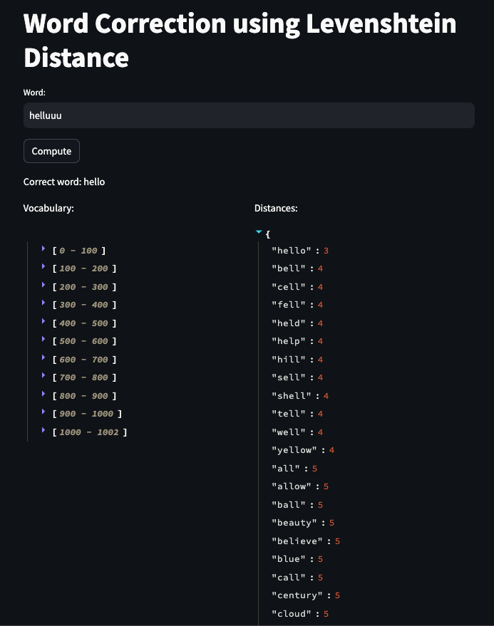
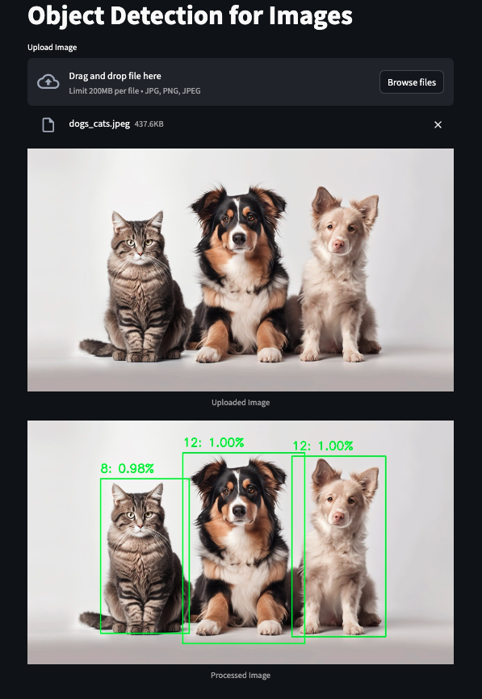
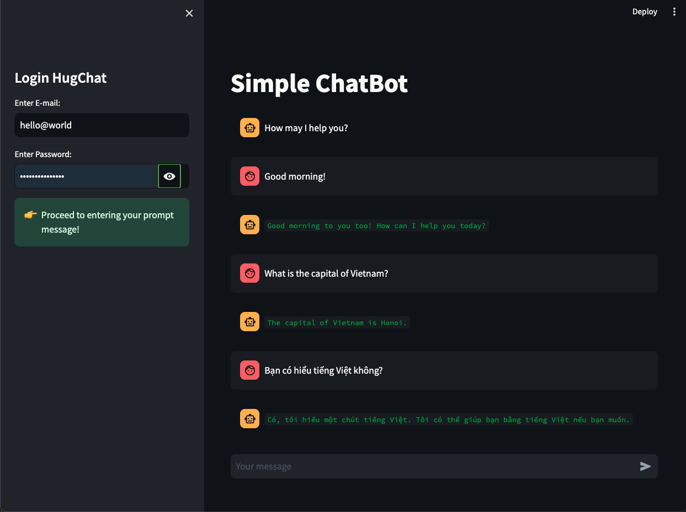

# Chatbot-Streamlit
This project contains three main AI applications developed using the Streamlit library: Word Correction, Object Detection, and Chatbot. Each application demonstrates a different aspect of AI and machine learning, providing a hands-on approach to deploying models with a user-friendly interface.

## Table of Contents
1. [Introduction](#introduction)
2. [Installation](#installation)
3. [Word Correction](#word-correction)
4. [Object Detection](#object-detection)
5. [Chatbot](#chatbot)
6. [Demo](#demo)

## Introduction

This project focuses on the practical implementation of AI applications using Streamlit. Streamlit is an open-source Python library that makes it eay to create and share custom web apps for machine learning and data science. In this project, you will find:

- **Word Correction:** An application that suggests correct spellings for input words using Levenshtein distance.
- **Object Detection:** An application that detects objects in images using a pre-trained deep neural network model.
- **Chatbot:** An application that interacts with users through a chatbot interface, leveraging Hugging Face's HugChat.

## Installation

To run these applications locally, follow these steps:

1. Clone this repository:
```bash
git clone https://github.com/toan-ly/Chatbot-Streamlit.git
cd Chatbot-Streamlit/source
```

2. Install the required dependencies:
```bash
pip install -r requirements.txt
```

3. Run the applications using Streamlit:
- For Word Correction:
```bash
streamlit run levenshtein_distance.py
```
- For Object Detection:
```bash
streamlit run object_detection.py
```
- For Chatbot:
```bash
streamlit run chatbot.py
```

## [Word Correction](https://chatbot-app-levenshtein.streamlit.app/)

### Description
The Word Correction application takes a user-inputted word and suggests the correct spelling using the Levenshtein distance algorithm. This applications showcases natural language processing capabilities and error correction.

### Usage
1. Run the application:
```bash
streamlit run levenshtein_distance.py
```
2. Enter a word in the input box and click "Compute".
3. The application will display the corrected word and the Levenshtein distances for each word in the vocabulary.

## [Object Detection](https://chatbot-app-objdetect.streamlit.app/)

### Description
The Object Detection application allows users to upload an image, and it will detect and highlight objects within the image using a pre-trained deep neural network model.

### Usage
1. Run the application:
```bash
streamlit run object_detection.py
```
2. Upload an image file.
3. The application will display the uploaded image with detected objects highlighted.

## [Chatbot](https://chatbot-app-hugchat.streamlit.app/)

### Description
The Chatbot application provides an interactive chat interface for users. It uses Hugging Face's HugChat to generate responses based on user input.

### Usage
1. Run the application:
```bash
streamlit run chatbot.py
```
2. Enter your Hugging Face credentials.
3. Start chatting with the bot.

## Demo

### Word Correction
<p align='center'>
  
</p>

### Object Detection
<p align='center'>
  
</p>

### Chatbot
<p align='center'>
  
</p>
